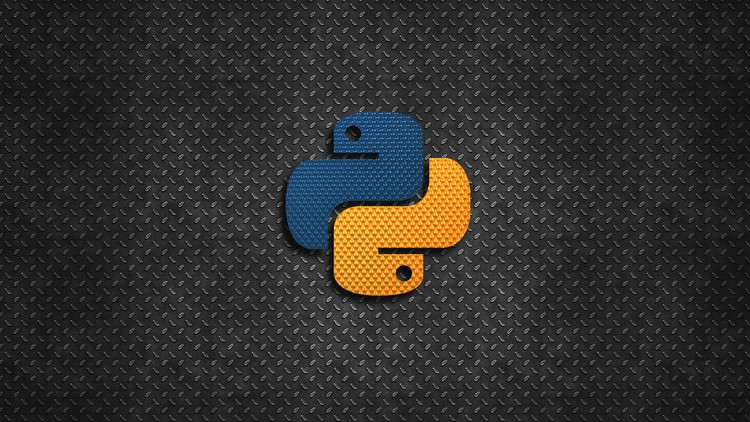

# Advanced Python Skills Course

Welcome to the [Advanced Python Skills](https://www.udemy.com/course/advanced-python-skills-become-a-better-python-developer/) course.

This a course hosted by David Armendáriz in Udemy.

In this repo, you will find all the scripts that I coded in the video lectures so you can have them!

Enjoy the course and if you have any questions, don't hesitate to contact me in [Math as a Second Language Discord Server](https://discord.gg/ej2F3Qj)
